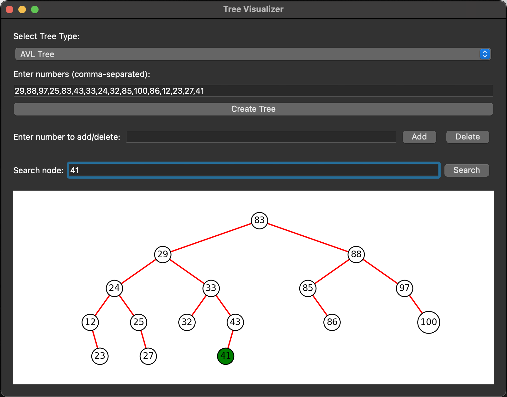

Tree Visualizer
===============

Tree Visualizer is a Python project that provides a graphical user interface (GUI) for visualizing Binary Search Trees (BST) and AVL Trees. The application leverages PyQt5 for the GUI and Matplotlib for the tree visualization. Users can interact with the tree structures by performing insertion, deletion, and search operations, with real-time visual feedback.

Features
--------

-   **Graphical User Interface**: Intuitive interface built with PyQt5, making it easy to interact with the tree structures.
-   **Tree Types**: Support for both Binary Search Trees and AVL Trees.
-   **Insertion**: Add nodes to the tree and see the structure update immediately.
-   **Deletion**: Remove nodes from the tree with instant visual feedback.
-   **Search**: Search for nodes in the tree. The searched node and its path are highlighted for better visibility.
-   **Visualization**: Real-time visualization of tree operations using Matplotlib. Paths to searched nodes are highlighted in green, while other paths are shown in red.

Installation
------------

1.  Clone the repository:

    ```bash
    git clone https://github.com/yourusername/tree-visualizer.git
    ```
    ```bash
    cd tree-visualizer
    ```

Usage
-----

1.  Run the application:

    ```bash
    python tree_visualizer.py
    ```

2.  Select the type of tree (Binary Search Tree or AVL Tree) from the dropdown menu.

3.  Enter the numbers (comma-separated) to create the initial tree and click "Create Tree".

4.  Use the input fields and buttons to add, delete, or search for nodes in the tree. The visualization will update in real-time to reflect the changes.

Screenshots
-----------



Dependencies
------------

-   PyQt5
-   Matplotlib

Contributing
------------

Contributions are welcome! Please fork the repository and submit a pull request with your changes.

License
-------

This project is licensed under the MIT License. See the LICENSE file for details.

Contact
-------

For any questions or suggestions, please open an issue or contact the project maintainer at ayushkrsingh1184@gmail.com.
